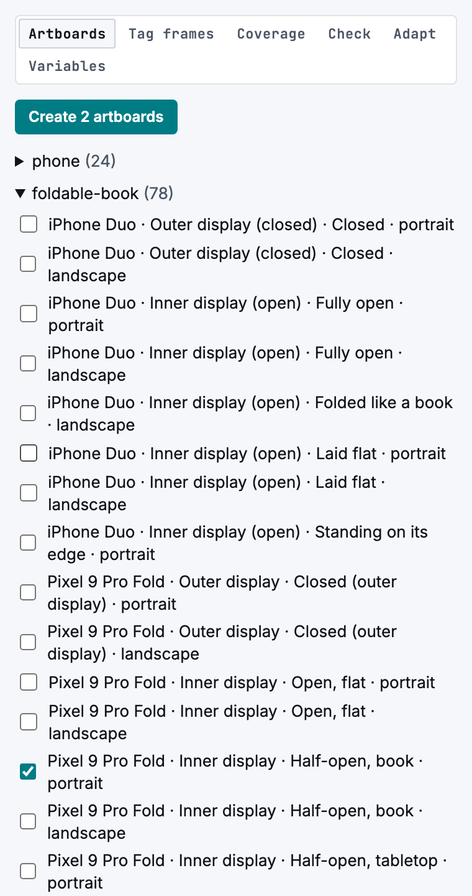
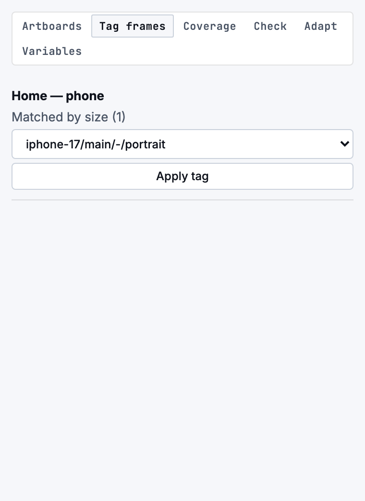
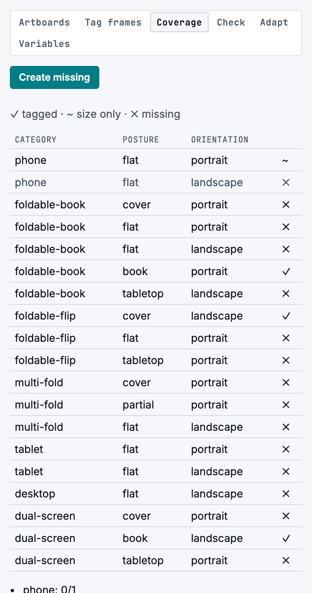
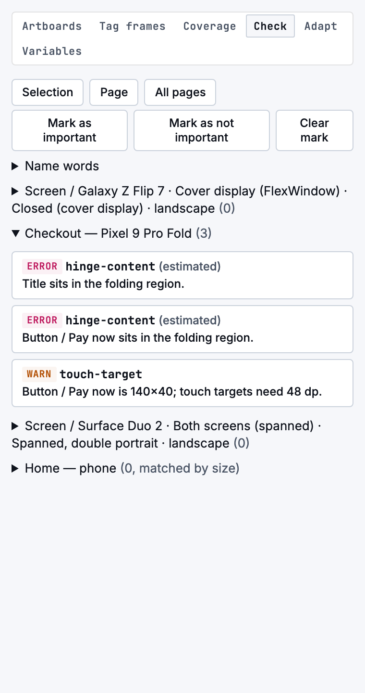
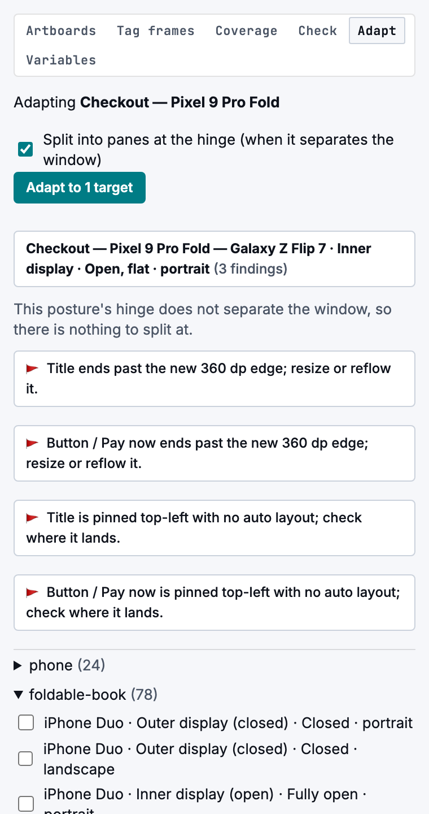
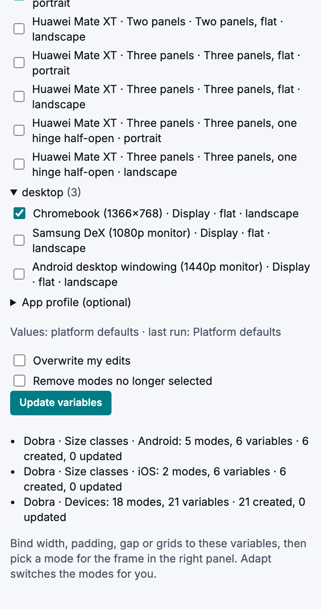

# Dobra for Figma: user guide

The Dobra plugin helps you design for phones, foldables, dual-screen devices, tablets and desktop in
Figma. It creates artboards with the hinge, safe areas and grid drawn in, checks your frames
against the foldable rules, adapts a frame to other devices, and writes size classes and devices as
Figma variables. This guide walks through each tab, then through three common workflows.

## Before you start

- **Install:** the plugin runs in Figma desktop.
  1. Build it once with `npm run build -w @dobra/figma-plugin`.
  2. In Figma, go to **Plugins › Development › Import plugin from manifest…** and choose
     `packages/figma-plugin/manifest.json`.
  3. Run it from **Plugins › Development › Dobra**.
- **Tabs:** the panel has six: **Artboards**, **Tag frames**, **Coverage**, **Check**, **Adapt** and
  **Variables**. Switching tabs keeps what you picked in each one.
- **Units:** sizes are in dp for Android devices and pt for Apple devices, one Figma pixel each.
- **Estimates:** anything estimated (a hinge safe zone, a threshold, a posture's geometry) is marked
  "(estimated)" in the panel, on the canvas and in variable descriptions.

## Artboards: start from the right size

Pick the devices, displays, postures and orientations you design for, then press **Create N
artboards**. The list is grouped by category (phone, foldable-book, foldable-flip, dual-screen,
multi-fold, tablet, desktop), with a count per group.

Each artboard comes with:

- **Size and shape:** the exact window size and the device's corner radius.
- **Overlay:** a locked `⎔ hinge-overlay` layer showing:
  - the hinge in rose, with a 16 dp safe zone around it (estimated);
  - safe-area insets in indigo;
  - reserved regions such as the camera, in amber.

  Hide the layer while you work, and show it again to check.
- **Grids:** a column grid for the window's width class (4, 8 or 12 columns, following Material 3).
  When the fold splits the window, there is also a two-pane grid split at the hinge.
- **A tag:** the plugin remembers which device, display, posture and orientation the artboard is
  for, so later checks don't have to guess from the size.

## Tag frames: connect frames you drew yourself

Frames you made by hand, or copied from another file, have no tag. The checks then fall back to
matching by size, which is ambiguous: one size can fit several devices. **Tag frames** lists every
untagged frame on the page with the devices whose size matches, within 1 px in either orientation.
Pick one and press **Apply tag**.

A frame whose size matches no device is listed with the nearest one. That usually means the frame
is a pixel or two off: resize it to the device size, then tag it.

## Coverage: see which devices and postures are missing

**Coverage** compares the page with the devices and postures a foldable-ready design should cover:
category × posture × orientation. For example, a book foldable needs its cover screen, flat and
half-open (book) layouts.

| Mark | Meaning |
|---|---|
| ✓ | A tagged frame covers this cell |
| ~ | A frame covers it by size only; tag it to make it count |
| ✗ | Nothing covers it yet |

**Create missing** adds an artboard for every missing required cell, at the right size, with its
overlay and tag. It does nothing when nothing is missing.

## Check: find what breaks on each device

**Check** runs the foldable rules. Choose the scope first:
- **Selection:** the selected artboards;
- **Page:** every artboard on the page;
- **All pages:** every artboard in the file.

Findings are listed per frame, and each one has a severity (error, warning or info), the rule and a
short message. Click a finding to select and zoom to the layer. On an artboard made by the plugin,
the properties panel also has a **Re-check** button.

| Rule | What it flags | Threshold |
|---|---|---|
| `hinge-content` | Text or a tappable layer on a hinge that splits or hides content | — |
| `pane-split` | A pane in an auto-layout row that crosses a separating hinge (heuristic) | — |
| `landscape-not-wide` | Side-by-side panes in a window narrower than 600, even in landscape | 600 |
| `min-legible-width` | Text of 20 or more characters narrower than 200 (estimated) | 200 |
| `chrome-overlap` | A bar covering content in a window shorter than 480 (estimated) | 480 |
| `touch-target` | A tappable layer smaller than 48 dp (Android) or 44 pt (iOS) | 48 / 44 |
| `overflow-x` | Content wider than the frame, outside horizontal scrollers | — |
| `tabletop-controls` | Controls above the fold in tabletop posture (heuristic) | — |
| `frame-size-mismatch` | A tagged frame whose size differs from its device | 1 px |

A frame matched by size only is checked against every device it could be. The hinge rules then
assume the fold splits and hides content, which is the worst case, so tag frames to get exact
results.

### How layers are classified

The rules need to know which layers are text, which are tappable and which are bars:
- **Text layers** are text.
- **Tappable layers** are component instances, and layers named like `button`, `cta`, `card`,
  `link`, `chip`, `tab`, `toggle` or `input`.
- **Bars (chrome)** are layers named like `nav`, `tab bar`, `toolbar`, `app bar`, `bottom bar`,
  `header` or `footer`.

Names match as whole words in any case, so "Tab bar" and "Tabbar" both count.

When the automatic reading is wrong, correct it:
- **Mark as important:** the selected layers count as content in the hinge check, whatever their
  names. Use it for a chart, a price or a signature area.
- **Mark as not important:** the selected layers, and everything inside them, are skipped by the
  hinge and touch-target checks. Use it for decoration that sits on the fold on purpose.
- **Clear mark:** returns the layers to automatic classification.
- **Name words:** edits the list of words that make a layer a control or chrome. The list is saved
  in the file for everyone, and **Reset to defaults** restores the built-in words.

Marks and name words are stored in the file, so the web report reads them too.

## Adapt: turn one design into the next device

Select one frame, tick the devices to adapt it to, and press **Adapt to N targets**. Tick **Split
into panes at the hinge** to add a two-pane grid where the fold separates the window.

For each target, the plugin makes a copy (the original stays as it is), then:
1. resizes the copy and redraws the overlay and grids;
2. tags the copy;
3. swaps component variants named `Size` or `Posture` to the new size class or posture;
4. switches the Dobra variable collections to the matching modes (see Variables);
5. checks the copy.

It never redesigns for you. It lists what needs your decision:
- content past the new edge;
- layers pinned top-left without auto layout, when the width changes by more than 20%;
- a bottom bar that should become a rail at 600 and wider;
- images whose frame changed shape;
- which content goes in each pane.

## Variables: size classes and devices you can bind to

**Variables** writes Figma variable collections to the file:

| Collection | Modes | Variables |
|---|---|---|
| Dobra · Size classes · Android | Compact, Medium, Expanded, Large, ExtraLarge | `layout/margin`, `layout/gutter`, `layout/columns`, `layout/panes`, `breakpoint/min-width`, `breakpoint/max-width` (0 means no limit) |
| Dobra · Size classes · iOS | Compact, Regular | the same six |
| Dobra · Devices | one per device and posture you pick | `window/width`, `window/height`, `safe-area/*`, `hinge/present`, `hinge/separating`, `hinge/x`, `hinge/y`, `hinge/width`, `hinge/height`, `layout/*`, `size-class/width`, `size-class/height`, `media/pointer`, `media/keyboard`, `media/viewing-distance` |

1. Choose what to write:
   - **Size classes**, for Android, iOS or both;
   - **Devices**, where **Required coverage** and **All foldables** pick sets for you and
     **Clear** empties the list.
2. Optionally load an **App profile** so the values are your app's, not the platform defaults.
3. Press **Create variables**, or **Update variables** once they exist. The summary lists what was
   created, updated or kept.

**Use them:** bind a frame's width, padding, gap or layout grid to a variable (in Figma's right
panel, use the variable button next to the field). Then pick a mode for the frame, for example
Compact or Expanded, or a device. The frame follows. **Adapt** switches these modes for you on
every copy it makes.

**Running it again is safe:**
- Values you edited in Figma are kept and listed as "Kept your edit", unless you tick **Overwrite
  my edits**.
- Modes for devices you no longer pick are kept, unless you tick **Remove modes no longer
  selected**. A collection always keeps at least one mode.
- Variables Dobra no longer writes are listed, never deleted.
- You can rename collections and variables, and your bindings keep working.
- The whole run is one undo step.

**Figma plan limits:** plans limit the number of modes per collection. When Figma refuses a mode,
Dobra splits the device collection by category (`Dobra · Devices · Foldable book`), and then into
numbered parts. Each part is its own collection, so bind a frame to the part that holds the modes
it needs.

Every variable's description says where its value comes from, and "(estimated)" when it is an
estimate.

## Workflow: a new foldable-ready design

1. **Artboards:** create the phone, the book foldable (cover, flat and half-open) and a flip's
   cover screen. Or open **Coverage** and press **Create missing**.
2. **Variables:** create the size-class collections and bind your frames' margins, gutters and
   column grids to them.
3. Design one screen, then use **Adapt** to copy it to the other devices. Fix what it flags.
4. **Check** the page (**Page** scope) before each review.

## Workflow: audit an existing file

A real product file shows the typical first run. It had 46 frames, none tagged:

- **Matched by size:** 16 frames were drawn for a dual-screen phone and matched it by size alone.
  They cover 3 coverage cells as "~ size only"; the other 16 required cells are missing.
- **Matched nothing:** 30 frames matched no device. Most of them were 19 phone frames at 404×874
  and 402×870: one or two points off the nearest device, 402×874.
- **Findings:** checking the matched frames found 6 `hinge-content` errors (a heading across the
  fold) and 5 `overflow-x` warnings (an image past the frame's edge).

What to do:

1. **Tag frames:** resize the near-miss frames to the device size and tag them. Tag the size-only
   matches too, so they count as ✓ and are checked against one device.
2. **Coverage:** see which postures and categories are missing, and **Create missing** for the ones
   you need.
3. **Check** with the **All pages** scope. Fix the hinge errors first: move text and buttons off the
   fold, or split the layout into two panes at it.
4. Mark decoration that crosses the fold on purpose as **not important**, so it stops being flagged.

## Workflow: share results with the team

The web report (Foldable Check) reads the same file through the Figma API and shows coverage and
findings in the browser, with the same rules, tags, marks and name words:

1. Open the web report and paste the file link.
2. Paste a Figma personal access token with the `file_content:read` scope.
3. Press **Check file**, then download the report as JSON or Markdown for a ticket.

The report can also check a website instead of a Figma file (the **Website** input), and open
report JSONs made by the command-line checker or the simulator.

## Troubleshooting

| What you see | Why | What to do |
|---|---|---|
| A frame is listed with "nearest …" | Its size is off by more than 1 px from every device | Resize it to the device size, then tag it |
| "matched by size" on many frames | They have no tag | Use **Tag frames** |
| A decorative image is flagged on the hinge | It is read as content | **Mark as not important** |
| A custom control isn't checked | Its name has none of the control words | **Mark as important**, or add the word in **Name words** |
| Variables split into "part 2" | Your Figma plan's mode limit | Bind each frame to the part that holds its modes |
| Variables says "You need edit access to create variables" | You're in Dev Mode, or you can only view the file | Switch to Design mode, or ask for edit access; the other tabs still work |

## What a tag stores

The plugin stores its data as shared plugin data in the `dobra` namespace, which the Figma REST API
and the web report can read:
- **`target`:** the device, display, posture and orientation, for example
  `galaxy-z-fold-7/inner/book/landscape`. The posture is `-` when the device has none.
- **`catalogVersion`:** the catalog version the frame was created or tagged with.

The screenshots in this guide show the plugin's real panel running on a test double of the Figma
API, with a sample file.
