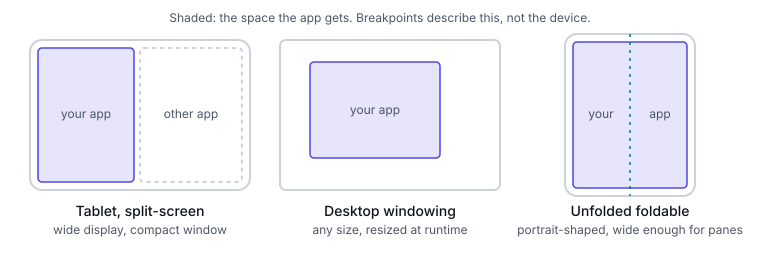

# Mental model

This part explains the ideas the platform parts build on. Layout follows the window the app gets
now, not the device it runs on, and it has two tools: branch at a breakpoint, or let one
structure flow. Read it first; the Android, iOS and Web parts carry the API detail.

## Window, not device or display

An app never owns the display. It gets a window, and that window changes size:

- **Android:** split-screen, desktop windowing, and folding or unfolding a foldable. Android's
  guidance is to avoid "physical hardware values for making layout decisions", because in these
  modes the physical screen size isn't relevant to how content should be shown
  ([display sizes](https://developer.android.com/develop/ui/compose/layouts/adaptive/support-different-display-sizes)).
- **iOS:** iPad windows are resizable, and apps "don't control multitasking configurations or
  receive any indication" of the ones people choose
  ([HIG: Multitasking](https://developer.apple.com/design/human-interface-guidelines/multitasking)).
- **Web:** the page lays out in the viewport of a browser window or tab, which the user resizes at
  will. The `resize` event fires when that view is resized
  ([MDN: resize](https://developer.mozilla.org/en-US/docs/Web/API/Window/resize_event)).

So the input to every layout decision is the window's current size. Not the device model, not the
screen size, and not the orientation. Orientation only says which side is longer. Apple's layout
guidance says the same thing from its side: size classes describe the space available, so decide
layout from them and not from device type or orientation
([HIG: Layout](https://developer.apple.com/design/human-interface-guidelines/layout)). The
[Anti-patterns](08-anti-patterns.md#reading-the-display-size-instead-of-the-window-size) part shows
what breaks when this rule is ignored.

## Available space as the input

Each platform turns available space into a small set of buckets, so code can ask "is there room
for two panes?" instead of comparing raw numbers everywhere. The buckets are defined differently
on each platform:

| | Android | iOS | Web |
|---|---|---|---|
| Name | Window size class | Size class | Breakpoint in a media or container query |
| Unit | `dp` | `pt` | CSS `px` (1/96 in) |
| How the bucket is set | Fixed thresholds on the window: 600, 840, 1200 and 1600 dp wide; 480 and 900 dp tall | Assigned by the system from device type, window configuration and multitasking state | Thresholds you choose from the content |
| Buckets per axis | Five for width, three for height | Two: `compact` and `regular` | As many as the content needs |
| Source | [Window size classes](https://developer.android.com/develop/ui/compose/layouts/adaptive/use-window-size-classes) | [HIG: Layout](https://developer.apple.com/design/human-interface-guidelines/layout) | [web.dev](https://web.dev/articles/responsive-web-design-basics), [MDN: CSS px](https://developer.mozilla.org/en-US/docs/Web/CSS/Reference/Values/length) |

Three points hold everywhere:

- **Buckets describe the window, not the device.** Android states that window size classes are
  "not intended for *isTablet*‑type logic" (window size classes page). iOS assigns compact width to
  a narrow iPad window ([iOS](03-ios.md#size-classes-are-assigned-not-measured)).
- **The web has no standard set.** web.dev advises against breakpoints based on device classes,
  products or operating systems, and says to let the content decide
  ([web.dev](https://web.dev/articles/responsive-web-design-basics)).
- **The buckets don't line up one to one.** iOS has no numeric thresholds, so any mapping to
  Android's classes is approximate. See the [breakpoint map](05-mapping.md#breakpoint-map).

## Two tools: branch and flow

A layout can respond to space in two ways.

**Branch.** Change the structure at a breakpoint: one pane becomes two, a navigation bar becomes a
rail or a sidebar, a sheet becomes a side panel. Structure is a discrete choice, so it needs a
threshold. Android's guidance is to use window size classes for high-level application layout
decisions: whether to use a multi-pane layout, for example
([window size classes](https://developer.android.com/develop/ui/compose/layouts/adaptive/use-window-size-classes)).

**Flow.** Keep one structure and let it stretch, wrap and reflow:

- **Grids that change column count:** CSS `repeat(auto-fit, minmax(…))` fits as many tracks as
  the row allows and collapses the empty ones
  ([MDN: repeat()](https://developer.mozilla.org/en-US/docs/Web/CSS/repeat)). Compose
  `GridCells.Adaptive` fits "as many columns as possible" of a minimum width
  ([Lists and grids](https://developer.android.com/develop/ui/compose/lists)). SwiftUI
  `GridItem.Size.adaptive(minimum:maximum:)` fits as many minimum-size items as it can
  ([GridItem.Size.adaptive](https://developer.apple.com/documentation/swiftui/griditem/size-swift.enum/adaptive(minimum:maximum:))).
- **Wrapping:** CSS `flex-wrap`, and Compose `FlowRow` and `FlowColumn`, where items move to the
  next line when the container runs out of space
  ([Flow layouts](https://developer.android.com/develop/ui/compose/layouts/flow)).
- **Intrinsic sizing:** widths set by content and by `min()`, `max()` and `clamp()` ranges, not by
  fixed numbers ([Web](04-web.md#intrinsic-layout)).

Flow is the default. It handles every width between two breakpoints, including the ones no one
tested. Branch only where the structure has to change.

| The question | Tool |
|---|---|
| How many panes? | Branch |
| Bar, rail or sidebar navigation? | Branch |
| Sheet or side panel for secondary content? | Branch |
| How many cards per row? | Flow |
| Where do chips or buttons wrap? | Flow |
| How wide is a column of text? | Flow, with a maximum width |
| Does a pane still fit its content? | Branch back to fewer panes when a pane would be too narrow |

The [Patterns](06-patterns.md) part shows both tools for each common screen.

### Local and global decisions

A decision can also be global or local.

- **Global:** the screen reads the window's size class and picks its structure: pane count and
  navigation type.
- **Local:** a component reacts to the space its parent gives it, so the same card works in a
  list, in a sidebar and in a dialog. On the web that is a container query, which styles a
  component by its container's size rather than the viewport
  ([MDN: @container](https://developer.mozilla.org/en-US/docs/Web/CSS/@container)). In SwiftUI,
  `ViewThatFits` picks "the first child view that fits" the proposed size
  ([ViewThatFits](https://developer.apple.com/documentation/swiftui/viewthatfits), iOS 16+). In
  Compose, `BoxWithConstraints` exposes the incoming constraints; Android notes it defers
  composition until the layout phase, so it has a cost
  ([display sizes](https://developer.android.com/develop/ui/compose/layouts/adaptive/support-different-display-sizes)).

Keep the global decision at the screen level and pass the result down. Reusable components should
decide locally: Android's guidance is that they shouldn't depend implicitly on global display
size information (same page).

## Folds and postures: a second input

On a foldable or a dual-screen device, size is not the whole story. A fold or hinge can split the
window into regions, and content that crosses it can be hard to read or hidden.

Ask two questions about each fold, not "which posture is this?":

- **Does it separate?** Android's `FoldingFeature.isSeparating` is true when the fold creates two
  logical display areas: always when the device is half-opened, and on a dual-screen device when
  the app spans both screens, even though the fold state there is flat. Split the layout at a
  separating fold.
- **Does it occlude?** `occlusionType` says whether the fold hides part of the display. If it does,
  keep content out of the fold's bounds
  ([fold-aware guide](https://developer.android.com/develop/ui/compose/layouts/adaptive/foldables/make-your-app-fold-aware)).

Posture names such as tabletop and book are shorthand for combinations of state and orientation.
They don't tell you where the fold is, or how many there are. A tri-fold has two hinges, so treat
folds as a list. On the web, viewport segments give the rectangles on each side of a fold, and a
non-foldable device reports one segment for the whole viewport
([MDN: Viewport segments](https://developer.mozilla.org/en-US/docs/Web/API/Viewport_segments_API)).
The Device Posture API only reports `continuous` or `folded`, which is why the Web part prefers
segments for layout.

APIs: [Android](02-android.md#foldables-and-postures) and
[Web](04-web.md#foldables-and-dual-screens-the-viewport-segments-api). On iOS, a fold is a reserved
region of kind `division`, and `ArrangementView` lays out along it (iOS 27.1 beta;
[iOS](03-ios.md#foldable-iphone-ios-271-beta)).

## Change is normal

The window can change at any moment while the app runs: a rotation, a resize, a fold. The user
doesn't relaunch the app to get a new layout, so two things must hold:

- **Layout re-evaluates.** Read size from state that updates: the Compose window adaptive info,
  the SwiftUI environment, CSS queries. SwiftUI warns to "be prepared to handle size class changes
  while your app runs"
  ([horizontalSizeClass](https://developer.apple.com/documentation/swiftui/environmentvalues/horizontalsizeclass)).
  On the web, listen for `change` on a `matchMedia` list rather than measuring once at load
  ([MDN: testing media queries](https://developer.mozilla.org/en-US/docs/Web/CSS/Guides/Media_queries/Testing)).
- **State survives.** On Android, folding and resizing in multi-window are configuration changes
  that recreate the Activity, and the guidance is: "Don't assume that configuration changes are
  rare or never happen"
  ([configuration changes](https://developer.android.com/guide/topics/resources/runtime-changes)).
  Keep UI state in `rememberSaveable` or a `ViewModel`
  ([Android](02-android.md#configuration-changes)). Apple's multitasking guidance says an app
  must always be ready to save and restore people's context (HIG: Multitasking). On the web, test
  a live resize, not only a reload
  ([Web](04-web.md#testing-and-the-limits-of-emulation)).

A branch that swaps one pane for two must not drop the selected item, the scroll position or a
half-filled form. Hold that state above the branch, so both layouts read it.

## Content first

Breakpoints exist to serve content. Measure what the content needs, at the user's text size:

- **Line length.** web.dev suggests 70 to 80 characters per line and adding a breakpoint where
  text runs longer ([web.dev](https://web.dev/articles/responsive-web-design-basics)). A pane that
  is too narrow is as bad as a line that is too long.
- **Touch targets.** At least 48 × 48 dp on Android
  ([accessibility](https://developer.android.com/guide/topics/ui/accessibility/apps)); 44 × 44 pt
  by default and 28 × 28 pt at minimum on iOS
  ([HIG: Accessibility](https://developer.apple.com/design/human-interface-guidelines/accessibility)).
- **Text at the user's size.** Android's `sp` is scaled by the user's font size preference
  ([dimension resources](https://developer.android.com/guide/topics/resources/more-resources)),
  iOS text follows Dynamic Type, and the web's `rem` follows a root font size that user
  preferences may change
  ([MDN: length](https://developer.mozilla.org/en-US/docs/Web/CSS/Reference/Values/length)).
  Apple's layout guidance adds that at larger text sizes, side-by-side views may need to stack
  (HIG: Layout).

Larger text uses up space the same way a narrower window does, so a layout that flows and branches
on available space handles both. The [Accessibility](07-accessibility.md#the-200-test) part covers the 200% test.

## Glossary entries

branch | Changing a layout's structure (pane count, navigation type) when available space crosses a breakpoint | Android, iOS, Web | Android: a check on `WindowSizeClass`; iOS: a check on the size class; Web: a media or container query | https://developer.android.com/develop/ui/compose/layouts/adaptive/use-window-size-classes
flow | Keeping one structure and letting it stretch, wrap or change column count as space changes, with no breakpoint | Android, iOS, Web | Android: `FlowRow`, `GridCells.Adaptive`; iOS: `GridItem.Size.adaptive`; Web: `flex-wrap`, `repeat(auto-fit, minmax(…))` | https://developer.android.com/develop/ui/compose/layouts/flow
local layout decision | A component choosing its layout from the space its parent gives it, not from the window | Android, iOS, Web | Android: `BoxWithConstraints`; iOS: `ViewThatFits`; Web: container queries | https://developer.android.com/develop/ui/compose/layouts/adaptive/support-different-display-sizes
global layout decision | A screen choosing its structure (panes, navigation) from the window's size class | Android, iOS, Web | Android: window size class; iOS: size class; Web: a media query on the viewport | https://developer.android.com/develop/ui/compose/layouts/adaptive/use-window-size-classes
ViewThatFits | A SwiftUI container that shows the first of its child views that fits the proposed size | iOS | Android: `BoxWithConstraints` with a size check; Web: a container query | https://developer.apple.com/documentation/swiftui/viewthatfits
BoxWithConstraints | A Compose layout that exposes the incoming constraints so its content can change with them; it defers composition to the layout phase | Android | iOS: `ViewThatFits`; Web: a container query | https://developer.android.com/develop/ui/compose/layouts/adaptive/support-different-display-sizes
FlowRow | A Compose row whose items move to the next line when the container runs out of space | Android | iOS: none built in [unverified — confirm before use]; Web: `flex-wrap: wrap` | https://developer.android.com/develop/ui/compose/layouts/flow

## Sources

- https://developer.android.com/develop/ui/compose/layouts/adaptive/support-different-display-sizes
- https://developer.android.com/develop/ui/compose/layouts/adaptive/use-window-size-classes
- https://developer.android.com/develop/ui/compose/layouts/adaptive/foldables/make-your-app-fold-aware
- https://developer.android.com/develop/ui/compose/layouts/flow
- https://developer.android.com/develop/ui/compose/lists
- https://developer.android.com/guide/topics/resources/runtime-changes
- https://developer.android.com/guide/topics/resources/more-resources
- https://developer.android.com/guide/topics/ui/accessibility/apps
- https://developer.apple.com/design/human-interface-guidelines/layout
- https://developer.apple.com/design/human-interface-guidelines/multitasking
- https://developer.apple.com/design/human-interface-guidelines/accessibility
- https://developer.apple.com/documentation/swiftui/environmentvalues/horizontalsizeclass
- https://developer.apple.com/documentation/swiftui/viewthatfits
- https://developer.apple.com/documentation/swiftui/griditem/size-swift.enum/adaptive(minimum:maximum:)
- https://developer.mozilla.org/en-US/docs/Web/API/Window/resize_event
- https://developer.mozilla.org/en-US/docs/Web/CSS/@container
- https://developer.mozilla.org/en-US/docs/Web/CSS/repeat
- https://developer.mozilla.org/en-US/docs/Web/CSS/Reference/Values/length
- https://developer.mozilla.org/en-US/docs/Web/CSS/Guides/Media_queries/Testing
- https://developer.mozilla.org/en-US/docs/Web/API/Viewport_segments_API
- https://web.dev/articles/responsive-web-design-basics
