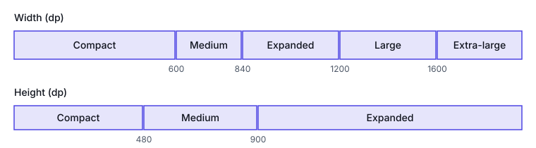
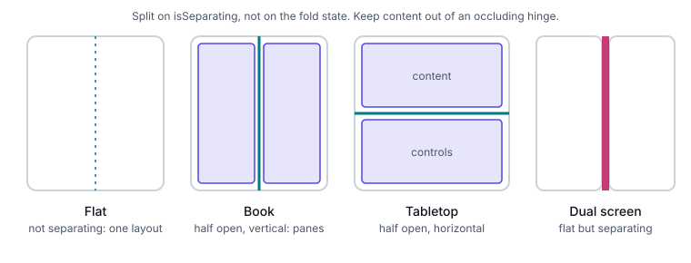

# Android and Jetpack Compose

This part answers the Android questions: which breakpoints Android uses and how to read them in
Compose, where the window's size comes from, how to handle folds and postures, and which adaptive
components, insets and platform rules shape a large-screen layout. API statements were checked
against the documentation and the androidx source; see the index for the versions.

## Window size classes

A window size class is a bucket for the space the app has, not the device it runs on. The
documentation is explicit: "window size classes are explicitly not determined by the size of the
device screen. Window size classes are not intended for *isTablet*‑type logic"
([Use window size classes](https://developer.android.com/develop/ui/compose/layouts/adaptive/use-window-size-classes)).

| Width class | Range | Height class | Range |
|---|---|---|---|
| Compact | < 600 dp | Compact | < 480 dp |
| Medium | 600 dp ≤ w < 840 dp | Medium | 480 dp ≤ h < 900 dp |
| Expanded | 840 dp ≤ w < 1200 dp | Expanded | ≥ 900 dp |
| Large | 1200 dp ≤ w < 1600 dp | | |
| Extra-large | ≥ 1600 dp | | |

Source: [Use window size classes](https://developer.android.com/develop/ui/compose/layouts/adaptive/use-window-size-classes).


Large and Extra-large were added in `androidx.window` 1.5.0
([release notes](https://developer.android.com/jetpack/androidx/releases/window)).

The class is `androidx.window.core.layout.WindowSizeClass`. You compare it against breakpoint
constants rather than reading a named bucket
([reference](https://developer.android.com/reference/androidx/window/core/layout/WindowSizeClass)):

- `isWidthAtLeastBreakpoint(widthDpBreakpoint)`, `isHeightAtLeastBreakpoint(heightDpBreakpoint)`,
  `isAtLeastBreakpoint(widthDpBreakpoint, heightDpBreakpoint)`.
- Constants: `WIDTH_DP_MEDIUM_LOWER_BOUND` (600), `WIDTH_DP_EXPANDED_LOWER_BOUND` (840),
  `WIDTH_DP_LARGE_LOWER_BOUND` (1200), `WIDTH_DP_EXTRA_LARGE_LOWER_BOUND` (1600),
  `HEIGHT_DP_MEDIUM_LOWER_BOUND` (480), `HEIGHT_DP_EXPANDED_LOWER_BOUND` (900).
- `windowWidthSizeClass` and `windowHeightSizeClass` are deprecated in favour of the breakpoint
  checks, and `WindowSizeClass.compute(…)` is deprecated in favour of `computeWindowSizeClass`.

In Compose, read the class from the adaptive info of the current window:

```kotlin
val windowSizeClass = currentWindowAdaptiveInfo(supportLargeAndXLargeWidth = true).windowSizeClass
val showTwoPanes = windowSizeClass.isWidthAtLeastBreakpoint(WindowSizeClass.WIDTH_DP_EXPANDED_LOWER_BOUND)
```

That call is from the
[display sizes guide](https://developer.android.com/develop/ui/compose/layouts/adaptive/support-different-display-sizes).
In Compose Material 3 Adaptive 1.3.0, `currentWindowAdaptiveInfo` is deprecated and
`currentWindowAdaptiveInfoV2()` replaces it
([release notes](https://developer.android.com/jetpack/androidx/releases/compose-material3-adaptive));
the V2 function also returns the window's posture
([fold-aware guide](https://developer.android.com/develop/ui/compose/layouts/adaptive/foldables/make-your-app-fold-aware)).
Use V2 on 1.3.0 and later.

The older `androidx.compose.material3:material3-window-size-class` artifact is still published
([Compose Material 3 releases](https://developer.android.com/jetpack/androidx/releases/compose-material3)).
The adaptive libraries moved to the Window Manager size classes: Navigation Suite 1.0.0-alpha04
notes "Migrate to use Window Manager version of window size classes" (same page). Use
`androidx.window.core.layout.WindowSizeClass` for new code. Whether the old artifact is formally
deprecated is [unverified — confirm before use].

## Where size comes from

Use the window, not the display. The documentation warns: "Avoid using physical hardware values
for making layout decisions", because in multi-window, desktop windowing, on ChromeOS or on a
foldable, "the physical screen size isn't relevant for deciding how to display content"
([Support different display sizes](https://developer.android.com/develop/ui/compose/layouts/adaptive/support-different-display-sizes)).

| Input | What it describes | Use it for layout? |
|---|---|---|
| `currentWindowAdaptiveInfoV2().windowSizeClass` | The current window's size class | Yes, in Compose |
| `WindowMetricsCalculator.getOrCreate().computeCurrentWindowMetrics(activity)` | "the area the window would occupy with MATCH_PARENT width and height" | Yes, outside Compose |
| `computeMaximumWindowMetrics(…)` | The largest area the window can expect | For planning, not current layout |
| Physical display size, device type | The hardware | No |

The `WindowMetricsCalculator` signatures are in the
[reference](https://developer.android.com/reference/androidx/window/layout/WindowMetricsCalculator).
How `Configuration.screenWidthDp` and `Resources.displayMetrics` relate to the window in each
windowing mode is [unverified — confirm before use]. Prefer the two sources above.

## Foldables and postures

`WindowInfoTracker.getOrCreate(context).windowLayoutInfo(activity)` returns a
`Flow<WindowLayoutInfo>` "that contains all the available features"
([reference](https://developer.android.com/reference/androidx/window/layout/WindowInfoTracker)).
In Compose, `collectFoldingFeaturesAsState()` returns a `State<List<FoldingFeature>>`: a list,
not one feature
([fold-aware guide](https://developer.android.com/develop/ui/compose/layouts/adaptive/foldables/make-your-app-fold-aware)).

`FoldingFeature` ([reference](https://developer.android.com/reference/androidx/window/layout/FoldingFeature)):

| Property | Values | Meaning |
|---|---|---|
| `state` | `FLAT`, `HALF_OPENED` | How far the device is folded |
| `orientation` | `HORIZONTAL`, `VERTICAL` | `HORIZONTAL` when the feature is wider than tall |
| `isSeparating` | `true` / `false` | Whether the feature splits the window "into multiple physical areas that can be seen by users as logically separate" |
| `occlusionType` | `NONE`, `FULL` | Whether the feature hides part of the window |
| `bounds` | `Rect` (from `DisplayFeature`) | Where the feature is, in window coordinates |



Postures, from the fold-aware guide:

| Posture | Condition |
|---|---|
| Tabletop | `state == HALF_OPENED` and `orientation == HORIZONTAL` |
| Book | `state == HALF_OPENED` and `orientation == VERTICAL` |

**Split on `isSeparating`, not on `state`.** `isSeparating` is true when the device is
`HALF_OPENED`, and on dual-screen devices when the app spans both screens, even though the
state there is `FLAT` (fold-aware guide). A flat foldable with a seamless inner screen is not
separating.

**Treat the features as a list.** The guide's own snippet takes `foldingFeatures.firstOrNull()`,
which is fine for single-hinge devices. A device with two hinges needs every entry. Trifolds
"don't support tabletop posture and cannot be used `HALF_OPENED`"
([Trifolds and landscape foldables](https://developer.android.com/develop/ui/compose/layouts/adaptive/foldables/trifolds-and-landscape-foldables)).
How many `FoldingFeature` objects a given tri-fold reports in each posture is
[unverified — confirm before use]. Test on the device or its emulator.

**Natural orientation can differ between displays.** "On a Pixel Fold, the natural orientation of
the device when folded is portrait, while the natural orientation when unfolded is landscape"
(trifolds page). Don't assume `ROTATION_0` means portrait.

```kotlin
@Composable
fun FoldAwareLayout() {
    val folds by collectFoldingFeaturesAsState()
    val separating = folds.filter { it.isSeparating }
    when {
        separating.any { it.orientation == FoldingFeature.Orientation.HORIZONTAL } -> TabletopLayout(separating)
        separating.isNotEmpty() -> PanesAtFolds(separating) // one pane per area between folds
        else -> SinglePane()
    }
}
```

## Adaptive components

| Component | Artifact | What it adapts |
|---|---|---|
| `NavigationSuiteScaffold` | `androidx.compose.material3:material3-adaptive-navigation-suite` | Navigation bar ↔ navigation rail |
| `ListDetailPaneScaffold`, `NavigableListDetailPaneScaffold` | `androidx.compose.material3.adaptive:adaptive-layout`, `adaptive-navigation` | List and detail side by side, or one at a time |
| `SupportingPaneScaffold`, `NavigableSupportingPaneScaffold` | same | Main pane plus a supporting pane |

**`NavigationSuiteScaffold`** shows a navigation bar "if the width or height is compact or if the
device is in tabletop posture", and a navigation rail for everything else. It changes as the
window resizes. The default comes from `NavigationSuiteScaffoldDefaults.calculateFromAdaptiveInfo(adaptiveInfo)`.
A drawer is not a default: to show `NavigationSuiteType.NavigationDrawer`, pass your own
`layoutType`
([Build adaptive navigation](https://developer.android.com/develop/ui/compose/layouts/adaptive/build-adaptive-navigation)).

```kotlin
val adaptiveInfo = currentWindowAdaptiveInfo()
val layoutType =
    if (adaptiveInfo.windowSizeClass.isWidthAtLeastBreakpoint(WindowSizeClass.WIDTH_DP_EXPANDED_LOWER_BOUND)) {
        NavigationSuiteType.NavigationDrawer
    } else {
        NavigationSuiteScaffoldDefaults.calculateFromAdaptiveInfo(adaptiveInfo)
    }
NavigationSuiteScaffold(navigationSuiteItems = { /* items */ }, layoutType = layoutType) { /* content */ }
```

**List-detail and supporting pane.** The scaffolds show panes side by side in large windows and
one at a time in small windows
([list-detail](https://developer.android.com/develop/ui/compose/layouts/adaptive/list-detail),
[supporting pane](https://developer.android.com/develop/ui/compose/layouts/adaptive/build-a-supporting-pane-layout)).
Navigate with `rememberListDetailPaneScaffoldNavigator()` or
`rememberSupportingPaneScaffoldNavigator()`, then `navigateTo(ListDetailPaneScaffoldRole.Detail, item)`
and `navigateBack(…)`.

Back behaviour is a `BackNavigationBehavior` (list-detail guide):

| Value | Effect |
|---|---|
| `PopUntilScaffoldValueChange` (default) | Back goes to the previous *layout*: in two panes, changing the detail doesn't add a back step |
| `PopUntilContentChange` | Back returns to the previously shown content |
| `PopUntilCurrentDestinationChange` | Back pops until the destination changes |
| `PopLatest` | Back removes only the latest entry |

The navigable scaffolds add predictive back. On Android 15 and lower that needs
`android:enableOnBackInvokedCallback="true"`, and on Android 16 it is on by default (list-detail
guide).

**Conflicts with existing navigation.** The navigator keeps its own back stack of pane
destinations. How it combines with an app's existing Navigation graph, in each navigation library
version, is [unverified — confirm before use]. Decide which one owns back before adopting the
scaffold.

## Insets and edge-to-edge

On Android 15 (API level 35) and higher, apps targeting SDK 35 draw under the system bars by
default: edge-to-edge is enforced
([About window insets](https://developer.android.com/develop/ui/compose/system/insets)).
Call `enableEdgeToEdge()` in `ComponentActivity.onCreate()`
([Set up edge-to-edge](https://developer.android.com/develop/ui/compose/system/setup-e2e)).

| Inset (`WindowInsets.*`) | Covers |
|---|---|
| `statusBars`, `navigationBars`, `systemBars` | System bars |
| `captionBar` | The window's header bar in desktop windowing |
| `ime` | The software keyboard |
| `displayCutout`, `waterfall` | Cutouts and curved edges |
| `systemGestures`, `mandatorySystemGestures`, `tappableElement` | Gesture and tap areas |
| `safeDrawing`, `safeGestures`, `safeContent` | Unions for "don't draw under" and "don't take gestures here" |

Modifiers: `windowInsetsPadding()`, `safeDrawingPadding()`, `imePadding()` and
`consumeWindowInsets()` (insets page).

**Three-button versus gesture navigation.** With three-button navigation, `enableEdgeToEdge()`
puts a translucent scrim behind the navigation bar. With gesture navigation the bars are
transparent. `window.isNavigationBarContrastEnforced = false` removes the scrim (edge-to-edge
page). The two modes give different bottom insets, so read `navigationBars` instead of hard-coding
a height. Their exact heights are [unverified — confirm before use].

## Configuration changes

"The system recreates an `Activity` when a configuration change occurs"
([Handle configuration changes](https://developer.android.com/guide/topics/resources/runtime-changes)).

| Topic | What the documentation says |
|---|---|
| `android:configChanges` | Declaring, for example, `orientation|screenSize|screenLayout|keyboardHidden` makes the system call `onConfigurationChanged()` instead of recreating; Compose recomposes with the new values |
| Size-related values | `screenSize`, `smallestScreenSize`, `screenLayout`, `orientation`, `density`, `keyboardHidden`, `uiMode` |
| The change still happens | "Disabling `Activity` recreation transfers the responsibility of handling that configuration change to the `Activity`". `AndroidView` and `AndroidFragment` still expect recreation |
| State | `remember` is lost on recreation; `rememberSaveable` survives recreation and process death; `ViewModel` survives recreation |
| Not a shortcut | Opting out doesn't prevent state loss from process death |

Unfolding, resizing a window and changing display size (density) are all configuration changes.
Keep UI state in `rememberSaveable` or a `ViewModel` so a fold doesn't reset the screen.

## Platform rules to know

**Android 16 (API level 36).** For apps targeting API 36, "orientation, resizability, and aspect
ratio restrictions no longer apply on displays with smallest width >= 600dp"
([Android 16 behaviour changes](https://developer.android.com/about/versions/16/behavior-changes-16)).
The following are ignored there: `screenOrientation`, `resizableActivity`, `minAspectRatio`,
`maxAspectRatio`, `setRequestedOrientation()` and `getRequestedOrientation()`.

- **Exceptions:** games (`android:appCategory`), users who opt in to the app's default in the
  device's aspect ratio settings, and screens smaller than `sw600dp`.
- **Opt-out:** `android.window.PROPERTY_COMPAT_ALLOW_RESTRICTED_RESIZABILITY` opts out an activity
  or the whole app. It is temporary: it "won't apply when targeting API level 37".

**`resizeableActivity`.** For apps targeting API 24 or higher it defaults to `true`
([Multi-window support](https://developer.android.com/develop/ui/compose/layouts/adaptive/support-multi-window-mode)).

## Multi-window and desktop windowing

The multi-window guide lists three modes
([Multi-window support](https://developer.android.com/develop/ui/compose/layouts/adaptive/support-multi-window-mode)):

| Mode | Behaviour |
|---|---|
| Split-screen | Two apps "side by side or one above the other" |
| Picture-in-picture | Video keeps playing in a small window |
| Desktop windowing | "users can freely resize each activity" |

- **Opening an adjacent window:** use `FLAG_ACTIVITY_LAUNCH_ADJACENT` with `FLAG_ACTIVITY_NEW_TASK`.
- **Detecting the mode:** `isInMultiWindowMode()` reports it.
- **Minimum size:** `<layout android:minWidth android:minHeight>` sets the smallest window in
  split-screen and desktop windowing.

Desktop windowing gives each app a resizable window with a header bar. Draw your own header with
`WindowInsets.captionBar` and `WindowInsets.isCaptionBarVisible`. Apps with a locked orientation
are freely resizable there. Apps with `resizeableActivity = false` "have their UI scaled while
maintaining aspect ratio"
([Desktop windowing](https://developer.android.com/develop/ui/compose/layouts/adaptive/support-desktop-windowing)).
Which devices and Android versions offer desktop windowing, and how Samsung DeX and ChromeOS
windows map onto these modes, is [unverified — confirm before use].

## Testing

| Method | What it shows | What it can't prove |
|---|---|---|
| Compose previews: `device = "spec:width=…,height=…,dpi=…"`, `Devices.FOLDABLE`, `Devices.TABLET`, `Devices.DESKTOP`, `@PreviewScreenSizes`, `@PreviewFontScale` ([Previews](https://developer.android.com/develop/ui/compose/tooling/previews)) | Layout at fixed sizes and font scales | Folding features, insets on a real device, window resizes, configuration changes |
| Emulators: 7.6" fold-in foldable, Pixel C tablet, Surface Duo, and the resizable emulator ([adaptive app quality](https://developer.android.com/docs/quality-guidelines/large-screen-app-quality)) | Postures, resizes and multi-window on real system software | Exact hardware values: many are the emulator's, not the device's |
| Test sizes from the quality guidelines: foldable 841×701 dp, 8" tablet 1024×640 dp, 10.5" tablet 1280×800 dp, 13" Chromebook 1600×900 dp (same page) | A minimum device matrix | Every window size in between: resize continuously too |
| `adb shell cmd device_state …` to change the fold state | Switching postures from a script | [unverified — confirm before use]: no primary page found |
| Screenshot tests | Regressions at fixed configurations | Behaviour while the window changes |

A physical device is still the only proof of hinge geometry and the real inset values.

## Glossary entries

adaptive layout | A layout that changes its structure (panes, navigation type) at defined breakpoints | Android, iOS, Web | iOS: size-class-driven layout; Web: media or container query breakpoints | https://developer.android.com/develop/ui/compose/layouts/adaptive/use-window-size-classes
book posture | A half-opened foldable with a vertical fold, used like an open book | Android | iOS: none; Web: two viewport segments side by side | https://developer.android.com/develop/ui/compose/layouts/adaptive/foldables/make-your-app-fold-aware
caption bar | The header bar the system draws on an app window in desktop windowing | Android | iOS: window title bar in Stage Manager [unverified — confirm before use]; Web: none | https://developer.android.com/develop/ui/compose/layouts/adaptive/support-desktop-windowing
compact | The smallest width (< 600 dp) or height (< 480 dp) window size class | Android | iOS: `UserInterfaceSizeClass.compact`, which is assigned by context, not a dp threshold; Web: none standard | https://developer.android.com/develop/ui/compose/layouts/adaptive/use-window-size-classes
configuration change | A change to the app's configuration (size, density, orientation, UI mode) that recreates the Activity unless handled | Android | iOS: trait collection change; Web: none | https://developer.android.com/guide/topics/resources/runtime-changes
desktop windowing | A mode where apps run in freely resizable windows with a header bar and taskbar | Android | iOS: Stage Manager on iPad; Web: a resizable browser window | https://developer.android.com/develop/ui/compose/layouts/adaptive/support-desktop-windowing
edge-to-edge | Drawing the app under the system bars and handling insets, enforced when targeting SDK 35 on Android 15+ | Android | iOS: drawing outside the safe area with `ignoresSafeArea`; Web: `viewport-fit=cover` | https://developer.android.com/develop/ui/compose/system/insets
expanded | The width class from 840 dp to below 1200 dp, or the height class from 900 dp | Android | iOS: none (closest: regular); Web: none standard | https://developer.android.com/develop/ui/compose/layouts/adaptive/use-window-size-classes
extra-large | The width class at 1600 dp and above | Android | iOS: none; Web: none standard | https://developer.android.com/develop/ui/compose/layouts/adaptive/use-window-size-classes
FoldingFeature | The androidx.window type describing a fold or hinge: state, orientation, isSeparating, occlusionType and bounds | Android | iOS: none; Web: Viewport Segments | https://developer.android.com/reference/androidx/window/layout/FoldingFeature
folding feature bounds | The rectangle, in window coordinates, that a folding feature occupies | Android | iOS: none; Web: the gap between `viewport-segment-*` rectangles | https://developer.android.com/reference/androidx/window/layout/FoldingFeature
free-form window | An app window the user can resize and move freely (desktop windowing) | Android | iOS: Stage Manager window; Web: browser window | https://developer.android.com/develop/ui/compose/layouts/adaptive/support-multi-window-mode
gesture navigation | System navigation by swipes, with transparent bars under edge-to-edge | Android | iOS: the home indicator gesture; Web: none | https://developer.android.com/develop/ui/compose/system/setup-e2e
half-opened | A `FoldingFeature.State` meaning the device is partly folded | Android | iOS: none; Web: none | https://developer.android.com/reference/androidx/window/layout/FoldingFeature
IME insets | The insets taken by the on-screen keyboard (`WindowInsets.ime`) | Android | iOS: keyboard safe area; Web: `VirtualKeyboard` API [unverified — confirm before use] | https://developer.android.com/develop/ui/compose/system/insets
isSeparating | Whether a folding feature splits the window into logically separate areas; the input that decides a split | Android | iOS: none; Web: more than one viewport segment | https://developer.android.com/reference/androidx/window/layout/FoldingFeature
large | The width class from 1200 dp to below 1600 dp | Android | iOS: none; Web: none standard | https://developer.android.com/develop/ui/compose/layouts/adaptive/use-window-size-classes
list-detail | A layout with a list and the selected item's detail, side by side or one at a time | Android, iOS, Web | iOS: `NavigationSplitView`; Web: a two-column grid | https://developer.android.com/develop/ui/compose/layouts/adaptive/list-detail
medium | The width class from 600 dp to below 840 dp, or the height class from 480 dp to below 900 dp | Android | iOS: none; Web: none standard | https://developer.android.com/develop/ui/compose/layouts/adaptive/use-window-size-classes
multi-window | Running more than one app on screen: split-screen, picture-in-picture or desktop windowing | Android | iOS: iPad multitasking; Web: none | https://developer.android.com/develop/ui/compose/layouts/adaptive/support-multi-window-mode
navigation rail | A vertical navigation bar at the side of the window | Android | iOS: sidebar in `NavigationSplitView` [unverified — confirm before use]; Web: none standard | https://developer.android.com/develop/ui/compose/layouts/adaptive/build-adaptive-navigation
navigation suite | `NavigationSuiteScaffold`, which picks a navigation bar or rail (or a drawer on request) from the window | Android | iOS: `TabView` sidebar adaptable style [unverified — confirm before use]; Web: none | https://developer.android.com/develop/ui/compose/layouts/adaptive/build-adaptive-navigation
occlusion type | Whether a folding feature hides part of the window (`NONE` or `FULL`) | Android | iOS: none; Web: a non-zero gap between segments | https://developer.android.com/reference/androidx/window/layout/FoldingFeature
pane | One region of a multi-pane layout, such as list, detail, supporting or extra | Android, iOS, Web | iOS: a column of `NavigationSplitView`; Web: a grid area | https://developer.android.com/develop/ui/compose/layouts/adaptive/list-detail
picture-in-picture | A small floating window that keeps video playing over other apps | Android, iOS | iOS: Picture in Picture; Web: Picture-in-Picture API | https://developer.android.com/develop/ui/compose/layouts/adaptive/support-multi-window-mode
resizable activity | An activity whose window the system may resize (`resizeableActivity`, true by default from API 24) | Android | iOS: none; Web: none | https://developer.android.com/develop/ui/compose/layouts/adaptive/support-multi-window-mode
split-screen | Two apps sharing the screen side by side or one above the other | Android | iOS: Split View on iPad; Web: none | https://developer.android.com/develop/ui/compose/layouts/adaptive/support-multi-window-mode
supporting pane | A pane beside the main content with related information or tools | Android, iOS, Web | iOS: inspector [unverified — confirm before use]; Web: an aside column | https://developer.android.com/develop/ui/compose/layouts/adaptive/build-a-supporting-pane-layout
tabletop posture | A half-opened foldable with a horizontal fold, standing on a surface | Android | iOS: none; Web: two viewport segments stacked vertically | https://developer.android.com/develop/ui/compose/layouts/adaptive/foldables/make-your-app-fold-aware
three-button navigation | System navigation with back, home and recents buttons; edge-to-edge adds a translucent scrim behind it | Android | iOS: none; Web: none | https://developer.android.com/develop/ui/compose/system/setup-e2e
tri-fold | A device with two hinges and three panels; it doesn't support tabletop or `HALF_OPENED` | Android | iOS: none; Web: up to three viewport segments [unverified — confirm before use] | https://developer.android.com/develop/ui/compose/layouts/adaptive/foldables/trifolds-and-landscape-foldables
waterfall display | A display whose edges curve over the sides, reported as `WindowInsets.waterfall` | Android | iOS: none; Web: none | https://developer.android.com/develop/ui/compose/system/insets
window insets | The areas of the window that system UI or hardware covers, and how much to pad | Android | iOS: safe area; Web: `env(safe-area-inset-*)` | https://developer.android.com/develop/ui/compose/system/insets
window metrics | The size and position of the app's window (`WindowMetricsCalculator`) | Android | iOS: the window scene's bounds [unverified — confirm before use]; Web: the viewport size | https://developer.android.com/reference/androidx/window/layout/WindowMetricsCalculator
window size class | A bucket for the app window's width or height, used to choose a layout | Android | iOS: size class (compact/regular, assigned by context); Web: breakpoints and container queries | https://developer.android.com/develop/ui/compose/layouts/adaptive/use-window-size-classes

## Sources

- https://developer.android.com/develop/ui/compose/layouts/adaptive/use-window-size-classes
- https://developer.android.com/develop/ui/compose/layouts/adaptive/support-different-display-sizes
- https://developer.android.com/develop/ui/compose/layouts/adaptive/foldables/make-your-app-fold-aware
- https://developer.android.com/develop/ui/compose/layouts/adaptive/foldables/trifolds-and-landscape-foldables
- https://developer.android.com/develop/ui/compose/layouts/adaptive/build-adaptive-navigation
- https://developer.android.com/develop/ui/compose/layouts/adaptive/list-detail
- https://developer.android.com/develop/ui/compose/layouts/adaptive/build-a-supporting-pane-layout
- https://developer.android.com/develop/ui/compose/layouts/adaptive/support-multi-window-mode
- https://developer.android.com/develop/ui/compose/layouts/adaptive/support-desktop-windowing
- https://developer.android.com/develop/ui/compose/system/insets
- https://developer.android.com/develop/ui/compose/system/setup-e2e
- https://developer.android.com/develop/ui/compose/tooling/previews
- https://developer.android.com/guide/topics/resources/runtime-changes
- https://developer.android.com/about/versions/16/behavior-changes-16
- https://developer.android.com/docs/quality-guidelines/large-screen-app-quality
- https://developer.android.com/jetpack/androidx/releases/window
- https://developer.android.com/jetpack/androidx/releases/compose-material3-adaptive
- https://developer.android.com/jetpack/androidx/releases/compose-material3
- https://developer.android.com/reference/androidx/window/core/layout/WindowSizeClass
- https://developer.android.com/reference/androidx/window/layout/FoldingFeature
- https://developer.android.com/reference/androidx/window/layout/WindowInfoTracker
- https://developer.android.com/reference/androidx/window/layout/WindowMetricsCalculator
