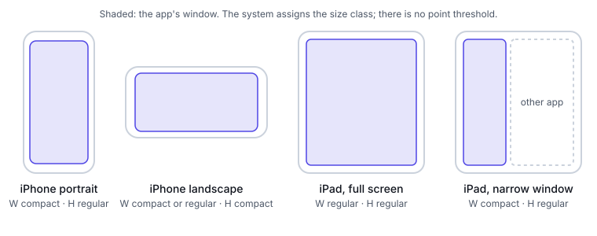

# iOS and SwiftUI

This part answers the iOS questions: what size classes are and who assigns them, which SwiftUI
containers adapt on their own, how safe areas and the keyboard work, what iPad windows mean for
layout, and how Dynamic Type changes it. Statements were checked against Apple's documentation;
availability is the one each reference page lists, checked 2026-09-28.

## Size classes are assigned, not measured

iOS has two size classes per axis, `compact` and `regular`
([UserInterfaceSizeClass](https://developer.apple.com/documentation/swiftui/userinterfacesizeclass),
iOS 13+). Read them from the environment:

```swift
@Environment(\.horizontalSizeClass) private var horizontalSizeClass
@Environment(\.verticalSizeClass) private var verticalSizeClass
```

**They are not dp thresholds.** The system sets them "based on the device type, window
configuration, and multitasking state; for example, whether an app is full screen, in Slide Over,
or mirrored from an iPhone to a Mac"
([HIG: Layout](https://developer.apple.com/design/human-interface-guidelines/layout)). SwiftUI
lists "the current device type", "the orientation of the device" and "the appearance of Slide Over
and Split View on iPad", and warns to "be prepared to handle size class changes while your app
runs"
([horizontalSizeClass](https://developer.apple.com/documentation/swiftui/environmentvalues/horizontalsizeclass)).
Under SwiftUI, UIKit exposes the same values as `UITraitCollection.horizontalSizeClass` and
`verticalSizeClass`, and traits flow down through windows, view controllers and views
([UITraitCollection](https://developer.apple.com/documentation/uikit/uitraitcollection)).

There is no numeric breakpoint table to give, because iOS does not use one. Free resizing is the one
place where Dobra's catalog records a threshold (600 pt). That figure is a modelling choice, not an
Apple number.



### Full-screen size classes by device

Apple's UIKit reference sends readers to "Human Interface Guidelines > Layout" for the size classes
an app gets full screen on each device. That page (change log: 9 September 2026) no longer lists
them. The table below is what Dobra's catalog records for full-screen apps. It is
[unverified — confirm before use] against a current Apple page.

| Device (full screen) | Portrait | Landscape |
|---|---|---|
| iPhone SE, iPhone mini, iPhone (standard) | compact width, regular height | compact width, compact height |
| iPhone Plus, iPhone Air, iPhone Pro Max | compact width, regular height | regular width, compact height |
| iPad (all sizes, full screen) | regular width, regular height | regular width, regular height |

A narrow iPad window has a compact width. So "iPad" never means "regular" for certain.

## Adaptive containers

| Container | What it adapts | Since |
|---|---|---|
| `NavigationSplitView` | Two or three columns; collapses to one stack when narrow | iOS 16 |
| `NavigationStack` | A single push-and-pop stack | iOS 16 |
| `ViewThatFits` | Picks "the first child view that fits" | iOS 16 [unverified — confirm before use] |
| `containerRelativeFrame(_:alignment:)` | Sizes a view relative to its nearest container | iOS 17 |
| `LazyVGrid` with `GridItem(.adaptive(minimum:maximum:))` | "Multiple items in the space of a single flexible item" | iOS 14 [unverified — confirm before use] |
| `GeometryReader` | Hands its content the size it gets | iOS 13 |

- **`NavigationSplitView`** "presents views in two or three columns, where selections in leading
  columns control presentations in subsequent columns"
  ([NavigationSplitView](https://developer.apple.com/documentation/swiftui/navigationsplitview)).
  - Use `init(sidebar:detail:)` for two columns and `init(sidebar:content:detail:)` for three.
  - `NavigationSplitViewVisibility` controls which columns show.
  - "With narrow sizes like on iPhone or on iPad in Slide Over", it "collapses all of its columns
    into a stack". `init(preferredCompactColumn:…)` chooses which column is on top.
- **`containerRelativeFrame`** sizes a view against "the window presenting a view on iPadOS or
  macOS, or the screen of a device on iOS", a split-view column, a stack, a tab, or a scroll view
  ([containerRelativeFrame](https://developer.apple.com/documentation/swiftui/view/containerrelativeframe(_:alignment:))).
  Use it for "a card is 80% of the column" without measuring anything.
- **`GeometryReader` is a last resort.** It "takes all the space offered by its parent and fills
  it" ([GeometryReader](https://developer.apple.com/documentation/swiftui/geometryreader)), so it
  changes the layout it's measuring. Reach for `ViewThatFits`, `containerRelativeFrame` or an
  adaptive grid first.
- **Adaptive grid columns:** `GridItem.Size.adaptive(minimum:maximum:)` fits as many columns as
  the minimum allows
  ([GridItem.Size](https://developer.apple.com/documentation/swiftui/griditem/size-swift.enum)).

```swift
LazyVGrid(columns: [GridItem(.adaptive(minimum: 180))], spacing: 16) {
    ForEach(items) { ItemCard(item: $0) }
}
```

## Safe areas and the keyboard

A safe area "defines the area within a window that isn't covered on the edge by a hardware feature
or another view within the window, like a toolbar, tab bar, or status bar". Respecting it keeps
"system UI and hardware features like the Dynamic Island" from obstructing content
([HIG: Layout](https://developer.apple.com/design/human-interface-guidelines/layout)).

| API | Use |
|---|---|
| Default layout | SwiftUI keeps views out of the safe areas, including the software keyboard |
| `ignoresSafeArea(_:edges:)` | Extend a background under the bars or the keyboard; `SafeAreaRegions` are `.container`, `.keyboard` and `.all` ([ignoresSafeArea](https://developer.apple.com/documentation/swiftui/view/ignoressafearea(_:edges:)), [SafeAreaRegions](https://developer.apple.com/documentation/swiftui/safearearegions)) |
| `safeAreaInset(edge:alignment:spacing:content:)` | Add your own bar: the view "is inset by the width of `content`, from `edge`, with its safe area increased by the same amount" ([safeAreaInset](https://developer.apple.com/documentation/swiftui/view/safeareainset(edge:alignment:spacing:content:))) |

**Keyboard avoidance** is the `.keyboard` region: views move out of its way unless you ignore
that region. **The home indicator and the Dynamic Island** are part of the container safe area.
Keep controls inside it, and let only backgrounds bleed out.

## iPad windows

The iPadOS guidance describes windowed apps: "app windows are resizable, and people can arrange
them to suit their needs with behavior similar to macOS". It adds that "apps don't control
multitasking configurations or receive any indication of the ones that people choose"
([HIG: Multitasking](https://developer.apple.com/design/human-interface-guidelines/multitasking),
change log 9 June 2025).

- **Resize continuously.** A window can be any size, so build from size classes and containers,
  not from device checks.
- **Names differ by page and version.** The current HIG page doesn't name Split View, Slide Over
  or Stage Manager. SwiftUI's `NavigationSplitView` and `horizontalSizeClass` pages still mention
  Slide Over and Split View. Which modes each iPadOS version offers is
  [unverified — confirm before use].
- **Test at compact width on iPad.** A narrow iPad window gets a compact horizontal size class and
  collapses a split view to one column.

## Dynamic Type

Text scales with the user's chosen size. `DynamicTypeSize` has twelve ordered cases, from `xSmall`
to `accessibility5`, and `isAccessibilitySize` is true for the five `accessibility…` sizes, which
"are much larger than the rest"
([DynamicTypeSize](https://developer.apple.com/documentation/swiftui/dynamictypesize), iOS 15+).

```swift
@Environment(\.dynamicTypeSize) private var dynamicTypeSize

var body: some View {
    if dynamicTypeSize.isAccessibilitySize {
        VStack(alignment: .leading) { icon; label }   // stack when text is very large
    } else {
        HStack { icon; label }
    }
}
```

`ScaledMetric` scales a number, such as padding or an icon size, with Dynamic Type
([ScaledMetric](https://developer.apple.com/documentation/swiftui/scaledmetric)):

```swift
@ScaledMetric(relativeTo: .body) private var iconSize: CGFloat = 24
```

`relativeTo:` is [unverified — confirm before use] against your SDK. Layouts must survive the
accessibility sizes without clipping. See the Accessibility part for the 200% test.

## Human Interface Guidelines, as design guidance

The HIG is design guidance, not an API contract. What it says about layout:
- size classes are "an indication of how much horizontal and vertical space is available";
- layout guides give "standard margins around content and restrict the width of text for optimal
  readability";
- the page shows two- to nine-column grid examples
  ([HIG: Layout](https://developer.apple.com/design/human-interface-guidelines/layout)).

It doesn't prescribe margin or gutter numbers per size class. Dobra's catalog marks its iOS layout
defaults estimated for that reason.

## Testing

| Method | Shows | Can't prove |
|---|---|---|
| Xcode previews ([Previews in Xcode](https://developer.apple.com/documentation/swiftui/previews-in-xcode)) | A view at chosen devices and settings while you edit | Real window resizing, keyboard behaviour, device safe areas. Preview traits for orientation and fixed layouts are [unverified — confirm before use] |
| Simulator | Size classes per device and orientation, Dynamic Type sizes, the keyboard | Hardware feel and performance |
| A resizable iPad window | Continuous width changes and the compact-width collapse | Every device |

Check each screen at:
- compact width in portrait and landscape;
- a narrow iPad window;
- the largest accessibility text size;
- with the keyboard up.

## Glossary entries

compact | The smaller size class on an axis, assigned by the system from device, orientation and window | iOS | Android: the compact window size class (< 600 dp wide, < 480 dp tall), which is a threshold; Web: none standard | https://developer.apple.com/documentation/swiftui/userinterfacesizeclass
regular | The larger size class on an axis, assigned by the system | iOS | Android: medium and wider classes (no one-to-one match); Web: none standard | https://developer.apple.com/documentation/swiftui/userinterfacesizeclass
size class | Apple's compact/regular description of the space available on each axis, set by the system rather than measured in points | iOS | Android: window size class (dp thresholds); Web: media or container query breakpoints | https://developer.apple.com/design/human-interface-guidelines/layout
Dynamic Type | The iOS system for scaling text to the user's chosen size, from xSmall to accessibility5 | iOS | Android: font scale and `sp`; Web: user zoom and `rem` | https://developer.apple.com/documentation/swiftui/dynamictypesize
Dynamic Island | The pill-shaped area at the top of recent iPhones, covered by the safe area | iOS | Android: display cutout; Web: `env(safe-area-inset-top)` | https://developer.apple.com/design/human-interface-guidelines/layout
home indicator | The bar at the bottom of the screen for the home gesture, inside the bottom safe area | iOS | Android: gesture navigation handle; Web: `env(safe-area-inset-bottom)` | https://developer.apple.com/design/human-interface-guidelines/layout
safe area | The part of a window not covered by hardware or system bars | iOS | Android: window insets; Web: `env(safe-area-inset-*)` | https://developer.apple.com/design/human-interface-guidelines/layout
pt | Point, the iOS layout unit, independent of the screen's pixel density | iOS | Android: `dp`; Web: CSS `px` | https://developer.apple.com/design/human-interface-guidelines/layout
Stage Manager | An iPad window arrangement named in SwiftUI and older HIG text; the current HIG describes resizable windowed apps | iOS | Android: desktop windowing; Web: a resizable browser window | https://developer.apple.com/design/human-interface-guidelines/multitasking
NavigationSplitView | A SwiftUI container with two or three columns that collapses to a stack when narrow | iOS | Android: `ListDetailPaneScaffold`; Web: a grid with a container query | https://developer.apple.com/documentation/swiftui/navigationsplitview
inspector | A SwiftUI side panel that is a trailing column in regular width and a sheet in compact width | iOS | Android: supporting pane; Web: an aside column | https://developer.apple.com/documentation/swiftui/view/inspector(ispresented:content:)

## Sources

- https://developer.apple.com/documentation/swiftui/userinterfacesizeclass
- https://developer.apple.com/documentation/swiftui/environmentvalues/horizontalsizeclass
- https://developer.apple.com/documentation/uikit/uitraitcollection
- https://developer.apple.com/design/human-interface-guidelines/layout
- https://developer.apple.com/design/human-interface-guidelines/multitasking
- https://developer.apple.com/documentation/swiftui/navigationsplitview
- https://developer.apple.com/documentation/swiftui/view/containerrelativeframe(_:alignment:)
- https://developer.apple.com/documentation/swiftui/geometryreader
- https://developer.apple.com/documentation/swiftui/griditem/size-swift.enum
- https://developer.apple.com/documentation/swiftui/view/ignoressafearea(_:edges:)
- https://developer.apple.com/documentation/swiftui/safearearegions
- https://developer.apple.com/documentation/swiftui/view/safeareainset(edge:alignment:spacing:content:)
- https://developer.apple.com/documentation/swiftui/dynamictypesize
- https://developer.apple.com/documentation/swiftui/scaledmetric
- https://developer.apple.com/documentation/swiftui/view/inspector(ispresented:content:)
- https://developer.apple.com/documentation/swiftui/previews-in-xcode
