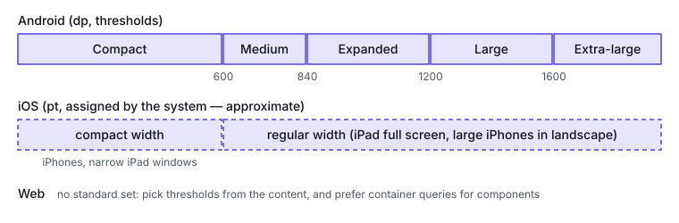

# Cross-platform mapping

This part answers two questions: what the same concept is called on Android, iOS and the Web, and
how their breakpoints line up. The platforms are peers. Where they don't match, the tables say so
instead of forcing a match. Each row links to the page that states it; the Android, iOS and Web
parts have the detail.

## Terminology map

| Concept | Android (Compose) | iOS (SwiftUI) | Web |
|---|---|---|---|
| A bucket for the space the app has | Window size class, `WindowSizeClass` ([Android](https://developer.android.com/develop/ui/compose/layouts/adaptive/use-window-size-classes)) | Size class, `UserInterfaceSizeClass` ([Apple](https://developer.apple.com/documentation/swiftui/userinterfacesizeclass)) | Breakpoints in a media or container query ([MDN](https://developer.mozilla.org/en-US/docs/Web/CSS/@container)) |
| How the bucket is decided | dp thresholds on the window | Assigned by the system from device, orientation and window ([HIG](https://developer.apple.com/design/human-interface-guidelines/layout)) | Thresholds you choose; web.dev: "let the content determine" them ([web.dev](https://web.dev/articles/responsive-web-design-basics)) |
| The current size | `currentWindowAdaptiveInfoV2()`, `WindowMetricsCalculator` ([Android](https://developer.android.com/reference/androidx/window/layout/WindowMetricsCalculator)) | The environment's size classes; the size a container proposes | The viewport (media queries), a container (container queries), `ResizeObserver` ([MDN](https://developer.mozilla.org/en-US/docs/Web/API/ResizeObserver)) |
| Areas covered by hardware or system UI | Window insets, `WindowInsets` ([Android](https://developer.android.com/develop/ui/compose/system/insets)) | Safe area ([HIG](https://developer.apple.com/design/human-interface-guidelines/layout)) | `env(safe-area-inset-*)` ([MDN](https://developer.mozilla.org/en-US/docs/Web/CSS/Reference/Values/env)) |
| Drawing under the bars | Edge-to-edge, `enableEdgeToEdge()` | `ignoresSafeArea(_:edges:)` ([Apple](https://developer.apple.com/documentation/swiftui/view/ignoressafearea(_:edges:))) | `viewport-fit=cover` |
| The keyboard's area | `WindowInsets.ime` | The `.keyboard` safe-area region ([Apple](https://developer.apple.com/documentation/swiftui/safearearegions)) | Covered in the Web part |
| Layout unit | `dp`: 1 dp ≈ 1 px at 160 dpi ([Android](https://developer.android.com/training/multiscreen/screendensities)) | `pt` | CSS `px`: 1/96 in ([MDN](https://developer.mozilla.org/en-US/docs/Web/CSS/Reference/Values/length)) |
| Text unit that follows the user's size | `sp`: "scaled by the user's font size preference" ([Android](https://developer.android.com/guide/topics/resources/more-resources)) | Dynamic Type sizes ([Apple](https://developer.apple.com/documentation/swiftui/dynamictypesize)) | `rem`: the root font size, which "user-defined preferences may modify" ([MDN](https://developer.mozilla.org/en-US/docs/Web/CSS/Reference/Values/length)) |
| A number that scales with text | Size in `sp`, or read the font scale | `ScaledMetric` ([Apple](https://developer.apple.com/documentation/swiftui/scaledmetric)) | `rem` or `em` |
| A fold or hinge | `FoldingFeature` ([Android](https://developer.android.com/reference/androidx/window/layout/FoldingFeature)) | None | Viewport Segments API, experimental and not Baseline ([MDN](https://developer.mozilla.org/en-US/docs/Web/API/Viewport_segments_API)) |
| List and detail | `ListDetailPaneScaffold` ([Android](https://developer.android.com/develop/ui/compose/layouts/adaptive/list-detail)) | `NavigationSplitView` ([Apple](https://developer.apple.com/documentation/swiftui/navigationsplitview)) | A grid with a container query |
| Supporting pane | `SupportingPaneScaffold` ([Android](https://developer.android.com/develop/ui/compose/layouts/adaptive/build-a-supporting-pane-layout)) | `inspector` ([Apple](https://developer.apple.com/documentation/swiftui/view/inspector(ispresented:content:))) | An `aside` column |
| Navigation that changes shape | `NavigationSuiteScaffold`: bar or rail ([Android](https://developer.android.com/develop/ui/compose/layouts/adaptive/build-adaptive-navigation)) | `TabView` with `.sidebarAdaptable`: sidebar or tab bar ([Apple](https://developer.apple.com/documentation/swiftui/tabview)) | Media query on the layout |
| Start and end of a line | Start/end | Leading/trailing | Logical properties ([MDN](https://developer.mozilla.org/en-US/docs/Web/CSS/CSS_logical_properties_and_values)) |
| Minimum touch target | 48 × 48 dp ([Android](https://developer.android.com/guide/topics/ui/accessibility/apps)) | 44 × 44 pt default, 28 × 28 pt minimum ([HIG: Accessibility](https://developer.apple.com/design/human-interface-guidelines/accessibility)) | No browser minimum; WCAG target-size criteria [unverified — confirm before use] |

`dp`, `pt` and CSS `px` all describe roughly the same physical size, but they are three separate
definitions, and a design value doesn't carry over exactly between them.

## Breakpoint map

| Window width | Android class ([source](https://developer.android.com/develop/ui/compose/layouts/adaptive/use-window-size-classes)) | iOS width size class (approximate) | Web |
|---|---|---|---|
| < 600 | Compact | Compact: iPhones in portrait, and narrow iPad windows | No standard |
| 600 – 840 | Medium | Compact or regular, depending on device and window | No standard |
| 840 – 1200 | Expanded | Usually regular (a full-screen iPad) | No standard |
| 1200 – 1600 | Large | Regular | No standard |
| ≥ 1600 | Extra-large | Regular | No standard |

| Window height | Android class | iOS height size class (approximate) |
|---|---|---|
| < 480 | Compact | Compact: iPhones in landscape |
| 480 – 900 | Medium | Regular |
| ≥ 900 | Expanded | Regular |

**The iOS columns are approximate, never exact.** iOS has no thresholds: the system assigns the
size class from device type, window configuration and multitasking state
([HIG: Layout](https://developer.apple.com/design/human-interface-guidelines/layout)). The same
width can get different size classes on different devices. Apple no longer publishes a per-device
table, so the full-screen values in the iOS part are [unverified — confirm before use].

**The web has no standard set.** web.dev advises against breakpoints "based on device classes, or
any product, brand name, or operating system"
([web.dev](https://web.dev/articles/responsive-web-design-basics)). The CSS sketches in the patterns
part use 600 and 480 px to mirror Android's classes. That's a choice for consistency across
platforms, not a web convention.

## Glossary entries

breakpoint | A width or height where a layout changes structure; on the web, choose it from the content, not from device classes | Android, Web | Android: window size class bounds (600, 840, 1200, 1600 dp wide; 480, 900 dp tall); iOS: none (size classes are assigned); Web: a media or container query condition | https://web.dev/articles/responsive-web-design-basics
touch target | The area of a control that accepts a tap | Android, iOS, Web | Android: at least 48 × 48 dp; iOS: 44 × 44 pt default, 28 × 28 pt minimum; Web: WCAG target size [unverified — confirm before use] | https://developer.android.com/guide/topics/ui/accessibility/apps

## Sources

- https://developer.android.com/develop/ui/compose/layouts/adaptive/use-window-size-classes
- https://developer.android.com/reference/androidx/window/layout/WindowMetricsCalculator
- https://developer.android.com/develop/ui/compose/system/insets
- https://developer.android.com/training/multiscreen/screendensities
- https://developer.android.com/guide/topics/resources/more-resources
- https://developer.android.com/reference/androidx/window/layout/FoldingFeature
- https://developer.android.com/develop/ui/compose/layouts/adaptive/list-detail
- https://developer.android.com/develop/ui/compose/layouts/adaptive/build-a-supporting-pane-layout
- https://developer.android.com/develop/ui/compose/layouts/adaptive/build-adaptive-navigation
- https://developer.android.com/guide/topics/ui/accessibility/apps
- https://developer.apple.com/documentation/swiftui/userinterfacesizeclass
- https://developer.apple.com/design/human-interface-guidelines/layout
- https://developer.apple.com/design/human-interface-guidelines/accessibility
- https://developer.apple.com/documentation/swiftui/view/ignoressafearea(_:edges:)
- https://developer.apple.com/documentation/swiftui/safearearegions
- https://developer.apple.com/documentation/swiftui/dynamictypesize
- https://developer.apple.com/documentation/swiftui/scaledmetric
- https://developer.apple.com/documentation/swiftui/navigationsplitview
- https://developer.apple.com/documentation/swiftui/view/inspector(ispresented:content:)
- https://developer.apple.com/documentation/swiftui/tabview
- https://developer.mozilla.org/en-US/docs/Web/CSS/@container
- https://developer.mozilla.org/en-US/docs/Web/API/ResizeObserver
- https://developer.mozilla.org/en-US/docs/Web/CSS/Reference/Values/env
- https://developer.mozilla.org/en-US/docs/Web/CSS/Reference/Values/length
- https://developer.mozilla.org/en-US/docs/Web/API/Viewport_segments_API
- https://developer.mozilla.org/en-US/docs/Web/CSS/CSS_logical_properties_and_values
- https://web.dev/articles/responsive-web-design-basics
