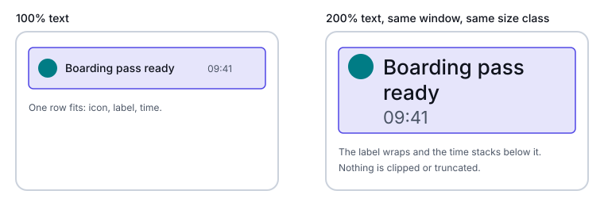
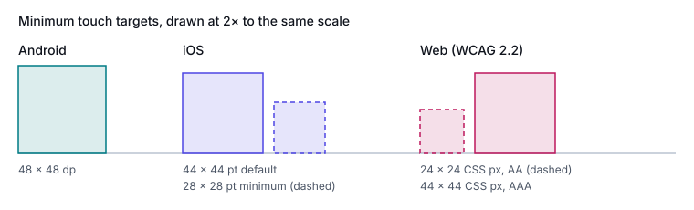

# Accessibility

This part covers the accessibility settings that change layout: larger text, touch target size,
right-to-left languages and orientation. Each one takes space or changes direction the same way
a different window does, so a layout that flows and branches on available space handles most of
it. The [Mental model](01-mental-model.md#content-first) part explains why.

## Text size is a second input

Every platform lets people make text larger, and none of them changes the size bucket when they
do:

| | Android | iOS | Web |
|---|---|---|---|
| Setting | Font size, up to 200% since Android 14, on a nonlinear curve ([Android 14](https://developer.android.com/about/versions/14/features#non-linear-font-scaling)) | Dynamic Type: 12 sizes, 5 of them accessibility sizes ([DynamicTypeSize](https://developer.apple.com/documentation/swiftui/dynamictypesize), iOS 15+) | Browser zoom, and the browser's default font size |
| Unit that follows it | `sp` | Text styles and `ScaledMetric` | `rem` and `em` |
| Does the bucket change? | No. Window size classes are measured in `dp`, which font size doesn't affect | No. The system assigns size classes from device type, window configuration and multitasking state ([HIG: Layout](https://developer.apple.com/design/human-interface-guidelines/layout)); text size isn't one of them | Zoom, yes: it shrinks the viewport in CSS pixels, so width media queries fire ([Understanding Reflow](https://www.w3.org/WAI/WCAG22/Understanding/reflow.html)). Default font size: only for queries written in `em` or `rem` |

So on Android and iOS, a phone at 200% text still reports the same size class as it does at 100%.
The layout has to absorb larger text inside the bucket it already chose: labels wrap, rows stack,
and nothing clips.



On the web, `em` in a media query is relative to the initial font size, "defined by the user agent
or the user's preferences, not any styling on the page"
([Media Queries Level 4](https://www.w3.org/TR/mediaqueries-4/#units)). A breakpoint written as
`48em` moves when the user raises the default font size; one written as `768px` doesn't.

## Scaling text on each platform

### Android

- **Text in `sp`, line height in `sp`.** Android 14's advice is to "always specify text sizes in
  sp units", and to define line height in `sp` too, so it scales with the text
  ([Android 14](https://developer.android.com/about/versions/14/features#non-linear-font-scaling)).
- **Spacing in `dp`, not `sp`.** Because scaling is nonlinear, "4sp + 20sp might not equal 24sp"
  (same page). Padding and view heights stay in `dp`.
- **No hand-written conversions.** Use `TypedValue.applyDimension()` and
  `TypedValue.deriveDimension()`; don't compute sizes from `Configuration.fontScale` or
  `DisplayMetrics.scaledDensity`, because "the `scaledDensity` field is no longer accurate"
  (same page).

In Compose, let rows wrap instead of clipping. `FlowRow` moves items to the next line when they
run out of space ([Flow layouts](https://developer.android.com/develop/ui/compose/layouts/flow)):

```kotlin
FlowRow(horizontalArrangement = Arrangement.spacedBy(8.dp)) {
    Text(title, style = MaterialTheme.typography.titleMedium)   // sizes in sp come from the theme
    Text(timestamp, style = MaterialTheme.typography.labelMedium)
}
```

### iOS

Use text styles so text follows Dynamic Type, and scale the numbers around text with
`ScaledMetric` ([ScaledMetric](https://developer.apple.com/documentation/swiftui/scaledmetric),
iOS 14+). At the accessibility sizes, switch a row to a stack. `AnyLayout` (iOS 16+) keeps the
child views and their state when the layout changes
([AnyLayout](https://developer.apple.com/documentation/swiftui/anylayout)):

```swift
@Environment(\.dynamicTypeSize) private var dynamicTypeSize

var body: some View {
    let layout = dynamicTypeSize.isAccessibilitySize
        ? AnyLayout(VStackLayout(alignment: .leading))
        : AnyLayout(HStackLayout())
    layout { icon; label; timestamp }
}
```

Apple's typography guidance says the same thing in design terms:

- "Consider using a stacked layout where text appears above secondary items".
- Reduce the number of columns as the font size increases.
- Aim to show as much text at the largest accessibility size as at the largest standard size
  ([HIG: Typography](https://developer.apple.com/design/human-interface-guidelines/typography)).

`dynamicTypeSize(_:)` can limit a view to a range of sizes
([dynamicTypeSize(_:)](https://developer.apple.com/documentation/swiftui/view/dynamictypesize(_:)-26aj0),
iOS 15+). Keep it for chrome that can't grow, such as a fixed-height bar, and never use it to keep
body text out of the accessibility sizes.

### Web

- **Font sizes in `rem`.** `rem` follows the root font size, which user preferences may change
  ([MDN: length](https://developer.mozilla.org/en-US/docs/Web/CSS/Reference/Values/length)).
- **Containers that grow with their text.** WCAG's sufficient techniques for resizing text include
  sizing text containers in `em` units (technique C28 in
  [Understanding Resize Text](https://www.w3.org/WAI/WCAG22/Understanding/resize-text.html)).
- **Fluid type that still reaches 200%.** Mix a relative unit into `clamp()`, and keep the maximum
  within 2.5 times the minimum. The [Web](04-web.md#intrinsic-layout) part has the details.
- **Room for spacing overrides.** WCAG 1.4.12 (AA) requires that nothing breaks when a user sets
  line height to 1.5 times the font size, paragraph spacing to 2 times, letter spacing to 0.12
  times and word spacing to 0.16 times ([WCAG 2.2](https://www.w3.org/TR/WCAG22/#text-spacing)).
  Fixed heights on text boxes are the usual failure; see
  [Anti-patterns](08-anti-patterns.md#fixed-height-containers-holding-user-scalable-text).

## The 200% test

Every platform sets the same bar: text at twice its default size, with nothing lost.

| Platform | Requirement | Source |
|---|---|---|
| Android | The system scales fonts up to 200% (Android 14 and later) | [Android 14](https://developer.android.com/about/versions/14/features#non-linear-font-scaling) |
| iOS | "Ideally, give people the option to enlarge text by at least 200 percent" | [HIG: Accessibility](https://developer.apple.com/design/human-interface-guidelines/accessibility) |
| Web | WCAG 1.4.4 (AA): text resizes up to 200 percent "without loss of content or functionality" | [WCAG 2.2](https://www.w3.org/TR/WCAG22/#resize-text) |
| Web | WCAG 1.4.10 (AA): no scrolling in two dimensions at a width of 320 CSS pixels, which is a 1280-pixel window at 400% zoom | [WCAG 2.2](https://www.w3.org/TR/WCAG22/#reflow), [Understanding Reflow](https://www.w3.org/WAI/WCAG22/Understanding/reflow.html) |

WCAG lists as a failure resizing text that "causes the text, image or controls to be clipped,
truncated or obscured"
([Understanding Resize Text](https://www.w3.org/WAI/WCAG22/Understanding/resize-text.html)). Use
that as the pass mark on every platform.

**How to run it:**

1. Set text to the largest size: 200% font size on Android; on iOS, turn on Larger Accessibility
   Text Sizes and pick the largest size (the HIG gives the path Settings > Accessibility > Display
   & Text Size > Larger Text); on the web, 200% zoom, then 400% zoom on a 1280-pixel window.
2. Open every screen in the smallest window you support first: a phone in portrait, a cover
   display, one pane of a split screen. That's where larger text runs out of room first.
3. Repeat in the other size classes and, on a foldable, in each posture. A layout that fits on
   one side of a fold at 100% text may not fit there at 200%.
4. Check each screen for clipped or truncated text, overlapping elements, controls pushed off
   screen, and, on the web, scrolling in two directions.

| Tool | What it covers |
|---|---|
| Compose `@PreviewFontScale`: seven previews from 85% to 200% (the androidx `ui-tooling-preview` source) | Each composable at every font scale, side by side |
| Compose `enableAccessibilityChecks()`, Compose 1.8.0 and later: flags small touch targets, low contrast, missing labels and traversal order ([Compose accessibility testing](https://developer.android.com/develop/ui/compose/accessibility/testing)) | Automated checks in UI tests |
| SwiftUI previews with `.dynamicTypeSize(.accessibility5)` | A view at the largest size |
| Browser zoom at 200% and 400% | WCAG 1.4.4 and 1.4.10 |

## Touch targets



| | Minimum | Spacing | Source |
|---|---|---|---|
| Android | At least 48 × 48 dp, "larger is even better"; smaller is fine for precise input such as a mouse or trackpad | — | [Android accessibility](https://developer.android.com/guide/topics/ui/accessibility/apps) |
| iOS | 44 × 44 pt default, 28 × 28 pt minimum | About 12 pt of padding around elements with a bezel, and about 24 pt around the visible edges of elements without one | [HIG: Accessibility](https://developer.apple.com/design/human-interface-guidelines/accessibility) |
| Web | WCAG 2.5.8 (AA): at least 24 × 24 CSS pixels. WCAG 2.5.5 (AAA): at least 44 × 44 | A smaller target passes 2.5.8 if a 24-pixel circle centred on it doesn't intersect another target or its circle | [Target Size (Minimum)](https://www.w3.org/WAI/WCAG22/Understanding/target-size-minimum.html), [Target Size (Enhanced)](https://www.w3.org/WAI/WCAG22/Understanding/target-size-enhanced.html) |

WCAG 2.5.8 also exempts:

- targets with an equivalent control on the page that meets the size;
- targets inline in text;
- targets sized by the browser;
- targets where the presentation is essential.

The visible control can be smaller than its target. Enlarge the area that takes the tap, not the
icon:

```kotlin
// Compose: Material components reserve 48 dp already; this does the same for custom ones.
Icon(Icons.Filled.Close, contentDescription = "Close",
    modifier = Modifier.minimumInteractiveComponentSize().clickable(onClick = onClose))
```

```swift
// SwiftUI: a 44 × 44 pt tap area around a small glyph.
Image(systemName: "xmark")
    .frame(minWidth: 44, minHeight: 44)
    .contentShape(Rectangle())
    .onTapGesture(perform: close)
```

```css
/* Web: a larger target where the pointer is a finger. */
.icon-button { min-inline-size: 24px; min-block-size: 24px; }
@media (pointer: coarse) {
  .icon-button { min-inline-size: 44px; min-block-size: 44px; }
}
```

- **Compose:** `Modifier.minimumInteractiveComponentSize()` reserves at least 48 dp, and
  `LocalMinimumInteractiveComponentSize` sets the size Material components use (48 dp by default;
  the androidx Material 3 source).
- **SwiftUI:** `contentShape(_:eoFill:)` defines the shape used for hit testing
  ([contentShape](https://developer.apple.com/documentation/swiftui/view/contentshape(_:eofill:))).
- **Web:** `pointer: coarse` matches a primary pointer "of limited accuracy, such as a finger on a
  touchscreen" ([MDN: pointer](https://developer.mozilla.org/en-US/docs/Web/CSS/Reference/At-rules/@media/pointer)).

On a foldable, keep targets out of the bounds of a separating or occluding fold
([Android](02-android.md#foldables-and-postures),
[Web](04-web.md#foldables-and-dual-screens-the-viewport-segments-api)). Half a target on each side
of a hinge is hard to hit.

## Right-to-left

In Arabic, Hebrew and other right-to-left languages, the layout mirrors: the start of a line is on
the right, the back button points right, and a layout built from start and end puts its first
pane on the right.

**What to flip, and what not to** ([HIG: Right to left](https://developer.apple.com/design/human-interface-guidelines/right-to-left)):

| Flip | Don't flip |
|---|---|
| Text alignment, to match the interface direction | Photos, illustrations and general artwork |
| Controls that show progress, such as sliders and progress bars | The digits inside a number, such as a phone number |
| Controls that navigate in order, such as back and next | Controls that point to a real direction or to an area on screen |
| Icons that show reading direction or forward and backward motion | Icons of real-world objects, such as clocks; logos and universal signs |

| | Android | iOS | Web |
|---|---|---|---|
| Turn it on | `android:supportsRtl="true"` in the manifest ([languages](https://developer.android.com/training/basics/supporting-devices/languages)) | On by default | The `dir` attribute on `<html>` |
| Name sides by flow | `start` and `end` in XML; Compose `padding(start = …)` follows the current `LayoutDirection`, and `absolutePadding` doesn't (the androidx `foundation-layout` source) | `leading` and `trailing` | Logical properties ([Web](04-web.md#logical-properties)) |
| Read the direction | `LocalLayoutDirection` | The `layoutDirection` environment value ([layoutDirection](https://developer.apple.com/documentation/swiftui/environmentvalues/layoutdirection)) | `:dir(rtl)`, Baseline Widely available since December 2023 ([MDN: :dir()](https://developer.mozilla.org/en-US/docs/Web/CSS/Reference/Selectors/:dir)) |
| Mirror icons | `android:autoMirrored="true"` on drawables; Compose `Icons.AutoMirrored` ([AutoMirrored](https://developer.android.com/reference/kotlin/androidx/compose/material/icons/Icons.AutoMirrored)) | SF Symbols provides right-to-left variants; `flipsForRightToLeftLayoutDirection(_:)` for your own images ([flipsForRightToLeftLayoutDirection](https://developer.apple.com/documentation/swiftui/view/flipsforrighttoleftlayoutdirection(_:))) | `:dir(rtl) .icon { transform: scaleX(-1); }` |
| Test it | The `ar-XB` pseudolocale ([pseudolocales](https://developer.android.com/guide/topics/resources/pseudolocales)); `@Preview(locale = "ar")` ([localization](https://developer.android.com/guide/topics/resources/localization)) | `.environment(\.layoutDirection, .rightToLeft)` in a preview | `dir="rtl"` on `<html>` |

On the web, prefer `:dir()` to `[dir=rtl]`: the attribute selector ignores elements that inherit
their direction, while `:dir()` "will match the value calculated by the user agent, even if
inherited" ([MDN: :dir()](https://developer.mozilla.org/en-US/docs/Web/CSS/Reference/Selectors/:dir)).

**Folds don't mirror.** A fold's bounds are physical positions in the window, and they stay where
they are in a right-to-left layout. When a layout splits at a fold, put the start pane on the
fold's right side in a right-to-left language, rather than always on the left.

## Orientation

WCAG 1.3.4 (AA) says content must not restrict "its view and operation to a single display
orientation" unless one is essential ([WCAG 2.2](https://www.w3.org/TR/WCAG22/#orientation)).
Android 16 enforces the same idea on large screens: on displays of `sw600dp` and up, it ignores an
app's orientation, resizability and aspect-ratio restrictions
([Android](02-android.md#platform-rules-to-know)). A layout that answers to the window's size,
not its orientation, meets both
([Anti-patterns](08-anti-patterns.md#branching-on-orientation-instead-of-available-width)).

## Glossary entries

font scale | The user's text size setting on Android, applied to `sp` units; up to 200% since Android 14, on a nonlinear curve so large text grows less than small text | Android | iOS: Dynamic Type size; Web: the browser's default font size, and zoom | https://developer.android.com/about/versions/14/features#non-linear-font-scaling
200% test | Checking every screen with text at twice its default size for clipped, truncated or overlapping content | Android, iOS, Web | Android: 200% font size; iOS: the largest accessibility Dynamic Type size; Web: WCAG 1.4.4 Resize Text | https://www.w3.org/TR/WCAG22/#resize-text
text spacing | WCAG 1.4.12: content must survive user overrides of line height (1.5×), paragraph spacing (2×), letter spacing (0.12×) and word spacing (0.16×) | Web | Android: none; iOS: none | https://www.w3.org/TR/WCAG22/#text-spacing
target size | WCAG's name for the tappable area of a control: 24 × 24 CSS pixels at AA (2.5.8), 44 × 44 at AAA (2.5.5) | Web | Android: touch target, 48 × 48 dp; iOS: control size, 44 × 44 pt default | https://www.w3.org/WAI/WCAG22/Understanding/target-size-minimum.html
minimum interactive component size | The 48 dp minimum that Compose Material components reserve for touch, set through `LocalMinimumInteractiveComponentSize` and applied to custom components with `Modifier.minimumInteractiveComponentSize()` | Android | iOS: a `frame(minWidth:minHeight:)` with `contentShape`; Web: `min-inline-size` and `min-block-size` | https://developer.android.com/guide/topics/ui/accessibility/apps
layout direction | Whether a layout runs left to right or right to left, set by the language | Android, iOS, Web | Android: `LayoutDirection`, `LocalLayoutDirection`; iOS: the `layoutDirection` environment value; Web: the `dir` attribute and `:dir()` | https://developer.apple.com/documentation/swiftui/environmentvalues/layoutdirection
auto-mirrored icon | An icon that flips itself in a right-to-left layout | Android, iOS, Web | Android: `android:autoMirrored`, `Icons.AutoMirrored`; iOS: SF Symbols variants, `flipsForRightToLeftLayoutDirection(_:)`; Web: none built in, use `:dir(rtl)` with a transform | https://developer.android.com/reference/kotlin/androidx/compose/material/icons/Icons.AutoMirrored
pseudolocale | A fake locale that tests text expansion (`en-XA`) or right-to-left layout (`ar-XB`) without translations | Android | iOS: none in this guide; Web: none | https://developer.android.com/guide/topics/resources/pseudolocales

## Sources

- https://developer.android.com/about/versions/14/features
- https://developer.android.com/develop/ui/compose/layouts/flow
- https://developer.android.com/develop/ui/compose/accessibility/testing
- https://developer.android.com/guide/topics/ui/accessibility/apps
- https://developer.android.com/training/basics/supporting-devices/languages
- https://developer.android.com/reference/kotlin/androidx/compose/material/icons/Icons.AutoMirrored
- https://developer.android.com/guide/topics/resources/pseudolocales
- https://developer.android.com/guide/topics/resources/localization
- https://developer.apple.com/documentation/swiftui/dynamictypesize
- https://developer.apple.com/documentation/swiftui/scaledmetric
- https://developer.apple.com/documentation/swiftui/anylayout
- https://developer.apple.com/documentation/swiftui/view/dynamictypesize(_:)-26aj0
- https://developer.apple.com/documentation/swiftui/view/contentshape(_:eofill:)
- https://developer.apple.com/documentation/swiftui/environmentvalues/layoutdirection
- https://developer.apple.com/documentation/swiftui/view/flipsforrighttoleftlayoutdirection(_:)
- https://developer.apple.com/design/human-interface-guidelines/layout
- https://developer.apple.com/design/human-interface-guidelines/typography
- https://developer.apple.com/design/human-interface-guidelines/accessibility
- https://developer.apple.com/design/human-interface-guidelines/right-to-left
- https://developer.mozilla.org/en-US/docs/Web/CSS/Reference/Values/length
- https://developer.mozilla.org/en-US/docs/Web/CSS/Reference/At-rules/@media/pointer
- https://developer.mozilla.org/en-US/docs/Web/CSS/Reference/Selectors/:dir
- https://www.w3.org/TR/WCAG22/
- https://www.w3.org/WAI/WCAG22/Understanding/reflow.html
- https://www.w3.org/WAI/WCAG22/Understanding/resize-text.html
- https://www.w3.org/WAI/WCAG22/Understanding/target-size-minimum.html
- https://www.w3.org/WAI/WCAG22/Understanding/target-size-enhanced.html
- https://www.w3.org/TR/mediaqueries-4/
- androidx source (`androidx-main`): `compose/ui/ui-tooling-preview` (`PreviewFontScale`), `compose/material3/material3` (`minimumInteractiveComponentSize`, `LocalMinimumInteractiveComponentSize`), `compose/foundation/foundation-layout` (`padding`, `absolutePadding`)
